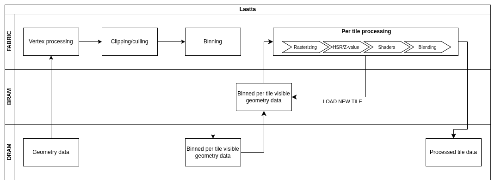

# Laatta — a small tile-based GPU on FPGA

A mobile-style tile-based deferred rendering (TBDR) GPU, built from scratch on an
Arty Z7 (Zynq-7000), following the architectural philosophy of ARM Mali / Imagination
PowerVR: bin triangles into small tiles, keep tile
color/depth data on-chip in BRAM for the full processing time, and minimize
off-chip DRAM traffic.

This is a learning project focused on **architecture-level decision-making**
(tile size, on-chip SRAM budget, binning strategy, warp/SIMT scheduling,
divergence handling) rather than just RTL implementation.

## Why this project

- Data movement dominates arithmetic cost in modern SoC/accelerator design —
  a TBDR GPU makes that trade-off concrete and measurable.

## Roadmap

- [ ] **Phase 0 — Architecture model.** Lightweight SystemC/C++ model of
      triangle setup → binning → tile buffer → rasterization. Used for
      design-space exploration (tile size vs. BRAM budget vs. memory traffic)
      and as the golden reference for verification later.
- [ ] **Phase 1 — Fixed-function pipeline.** Vertex transform, triangle setup,
      tile binner, tile buffer (BRAM), rasterizer, framebuffer. No shaders.
- [ ] **Phase 2 — Scalar shader core.** Single ALU, single thread, no warps —
      closer to a small VLIW/scalar unit than a GPU.
- [ ] **Phase 3 — SIMD.** Multiple lanes (e.g. 4) executing the same
      instruction in lockstep.
- [ ] **Phase 4 — SIMT.** Warp/active-lane masks, divergence stack,
      reconvergence — where it starts looking like a real GPU shader core.

## Architecture (high level)

## Verification

- Reference model: the Phase 0 architecture model doubles as a golden
  pixel-accurate reference.
- Scoreboard-based verification (UVM-style methodology) comparing RTL output
  against the reference model, pixel by pixel.

## Platform

- Digilent Arty Z7 (Zynq-7000 XC7Z020)
- Vivado, Vitis
- SystemC for the architecture model (Phase 0)

## Status

Early stage — architecture spec and Phase 0 model in progress.

## References

- ARM Mali GPU Architecture Overview whitepapers (developer.arm.com)
- Imagination PowerVR TBDR patents (Google Patents — "tile based deferred
  rendering hidden surface removal")
